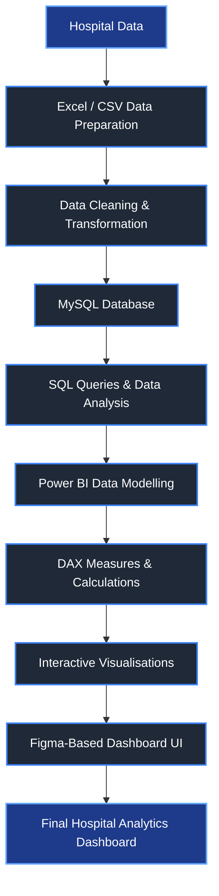

# Hospital-Management-Analysis
Interactive Hospital Management Dashboard built using Microsoft Power BI.
-----------------------------------------------------------
🏥 Hospital Management Analysis Dashboard
=
----------------------------------
📊 Project Overview
=
The Hospital Management Analysis Dashboard is an interactive data analytics and visualisation project developed using Power BI, MySQL, Microsoft Excel, and Figma.

The main objective of this project is to transform hospital-related patient and operational data into meaningful insights through an interactive and user-friendly dashboard. The dashboard enables users to analyse patient information, doctor details, pharmacy records, laboratory tests, billing information, and hospital performance metrics in a centralised platform.

This project demonstrates the practical application of Data Analytics, Data Visualisation, SQL, Data Cleaning, and Business Intelligence concepts in the healthcare domain.

-------
🎯 Objectives
=
•	To analyse and visualise hospital patient data effectively.

•	To provide an interactive dashboard for healthcare data analysis.

•	To identify trends and patterns in patient admissions and hospital operations.

•	To analyse patient demographics, diagnoses, departments, and length of stay.

•	To provide insights into doctors, pharmacy, laboratory tests, and billing data.

•	To improve data-driven decision-making using interactive Power BI reports.

•	To integrate structured data management using MySQL.

----------
🛠️ Tools & Technologies Used
=
### 🛠️ Tools & Technologies Used

| Tool / Technology | Purpose |
| :--- | :--- |
| **Microsoft Excel** | Used for creating, cleaning, formatting, and reporting data insights before importing them into the database. |
| **MySQL Database** | For building and managing the database structure and relationships between relational tables. |
| **MySQL Workbench** | Used to create, manage, and execute the MySQL Database by creating ERD diagrams and database tables. |
| **Microsoft Power BI Desktop** | Used to develop dashboards, measures, key reports, KPIs, filters, charts, tables, slicers, and visualisations. |
| **Power Query** | Used for data transformation, filtering data from connection, and providing data for analysis and reporting. |
| **DAX (Data Analysis Expressions)** | Used to generate customized data, measures, and data analytic models. |
| **Figma** | Used to design the dashboard prototype, navigation layout, and creative dashboard backgrounds. |

-------

📁 Project Modules
=
The dashboard is designed with multiple modules to provide a complete view of hospital operations.

-----

🏠 Home Page
=
•	Provides an overview of the complete dashboard.

•	Navigation buttons to access different dashboard pages.

•	User-friendly interface designed using Figma.

•	Supports navigation between major hospital data modules.

-----
👨‍⚕️ Patient Analysis
=
•	Total number of patients.

•	Patient demographic analysis.

•	Gender-wise patient distribution.

•	Blood group analysis.

•	Department-wise patient analysis.

•	Diagnosis-wise patient analysis.

•	Patient admission and discharge information.

•	Length of stay analysis.

•	Monthly admission trends.

-------

🩺 Doctor Analysis
==
•	Doctor-related information.

•	Doctor and patient assignment analysis.

•	Department-wise doctor insights.

•	Patient distribution based on assigned doctors.

-------
💊 Pharmacy Analysis
=
•	Pharmacy-related data analysis.

•	Medicine and prescription information.

•	Pharmacy records and patient-related insights.

------
🧪 Laboratory Test Analysis
=
•	Laboratory test records.

•	Test-related patient information.

•	Analysis of laboratory activities and results.

-------
💳 Billing Analysis
=
•	Patient billing information.

•	Billing-related records.

•	Analysis of hospital billing data.

----
⚙️ Settings / Admin
=
•	Dashboard settings and navigation.

•	Notification interface.

•	Dark and light theme concept.

•	User-friendly dashboard controls.

-----

📊 Key Dashboard Features
=
o	Interactive Power BI visuals.

o	KPI cards for important hospital metrics.

o	Monthly patient admission trend analysis.

o	Department-wise analysis.

o	Gender-wise analysis.

o	Blood group distribution.

o	Diagnosis analysis.

o	Patient status analysis.

o	Interactive slicers and filters.

o	Cross-filtering between visuals.

o	Navigation buttons between dashboard pages.

o	Dark and light theme UI concept.

o	Figma-based custom dashboard design.

o	Structured data management using MySQL.

------
🗃️ Dataset
=
The project uses structured hospital-related datasets containing information from different operational areas.

---
Patient Data
=
o	Patient ID

o	Patient Name

o	Age

o	Gender

o	Blood Group

o	Contact Number

o	Address

o	Admission Date

o	Discharge Date

o	Length of Stay

o	Department

o	Diagnosis

o	Assigned Doctor

o	Room Number

o	Room Type

o	Patient Status

-----

Other Data Modules
=
o	Doctor Data

o	Hospital Data

o	Pharmacy Data

o	Laboratory Test Data

o	Billing Data

The data is prepared and structured for analysis using Excel/CSV and MySQL, followed by data transformation and visualisation in Power BI.

------

🔄 Project Workflow
=

----

📈 Data Analysis & Visualisation
=
The Power BI dashboard provides interactive visualisations to understand hospital data efficiently.

Some of the major analysis areas include:

o	Patient admission trends over time.

o	Monthly admission analysis.

o	Patient distribution by department.

o	Patient distribution by gender.

o	Blood group distribution.

o	Diagnosis-wise patient analysis.

o	Patient status analysis.

o	Length of stay analysis.

o	Doctor-wise patient assignment.

o	Pharmacy and laboratory analysis.

o	Billing-related insights.

Users can interact with the dashboard using slicers, filters, navigation buttons, and interactive visuals to explore the data from different perspectives.

----------
🧮 SQL & Database Integration
=
MySQL is used as the database layer to store and manage structured hospital data.

SQL queries can be used for:

o	Retrieving patient records.

o	Filtering hospital data.

o	Grouping data by departments.

o	Analysing patient admissions.

o	Calculating summary statistics.

o	Joining related hospital datasets.

o	Generating analytical results for reporting.

This integration demonstrates how SQL-based data management can support business intelligence and dashboard development.

--------

🎨 UI/UX Design
=
The dashboard interface is designed with Figma to create a modern and user-friendly healthcare analytics experience.

The UI design focuses on:

o	Clean and professional healthcare-themed interface.

o	Easy navigation.

o	Consistent visual design.

o	Interactive page navigation.

o	Dark and light theme concept.

o	User-friendly dashboard layout.

o	Clear presentation of KPIs and analytical insights.

---------

🚀 Expected Outcome
=
The final outcome of this project is an interactive hospital analytics dashboard that helps users:

o	Understand patient-related trends.

o	Analyse hospital operations.

o	Monitor important healthcare metrics.

o	Explore patient and doctor information.

o	Analyse pharmacy, laboratory, and billing data.

o	Make better data-driven decisions.

o	Present complex hospital data in an easy-to-understand format.

------

🌟 Advantages
=
o	Centralised hospital data analysis.

o	Interactive and visually appealing dashboard.

o	Easy navigation between different modules.

o	Faster identification of trends and patterns.

o	Supports data-driven decision-making.

o	Reduces dependency on manual data analysis.

o	Provides a scalable foundation for future healthcare analytics solutions.

------

🔮 Future Enhancements
=
Future improvements may include:

o	Real-time hospital database integration.

o	Automated data refresh.

o	Predictive analysis for patient admission trends.

o	Machine learning-based patient risk prediction.

o	Hospital resource demand forecasting.

o	Advanced healthcare KPIs.

o	Role-based access control.

o	Cloud-based deployment.

o	Mobile-friendly dashboard support.

o	Integration with hospital management systems.

-------

📌 Conclusion
=
The Hospital Patient Data Analysis Dashboard demonstrates how data analytics and business intelligence tools can be applied to the healthcare domain.

By combining Excel, MySQL, SQL, Power BI, DAX, Power Query, and Figma, the project transforms raw hospital data into meaningful and interactive insights.

The dashboard provides a comprehensive analytical view of patients, doctors, pharmacy, laboratory tests, and billing information, helping users understand hospital data more effectively and supporting data-driven decision-making.

👩‍💻 Developed By
=
Jenifer.S

Artificial Intelligence and Data Science

